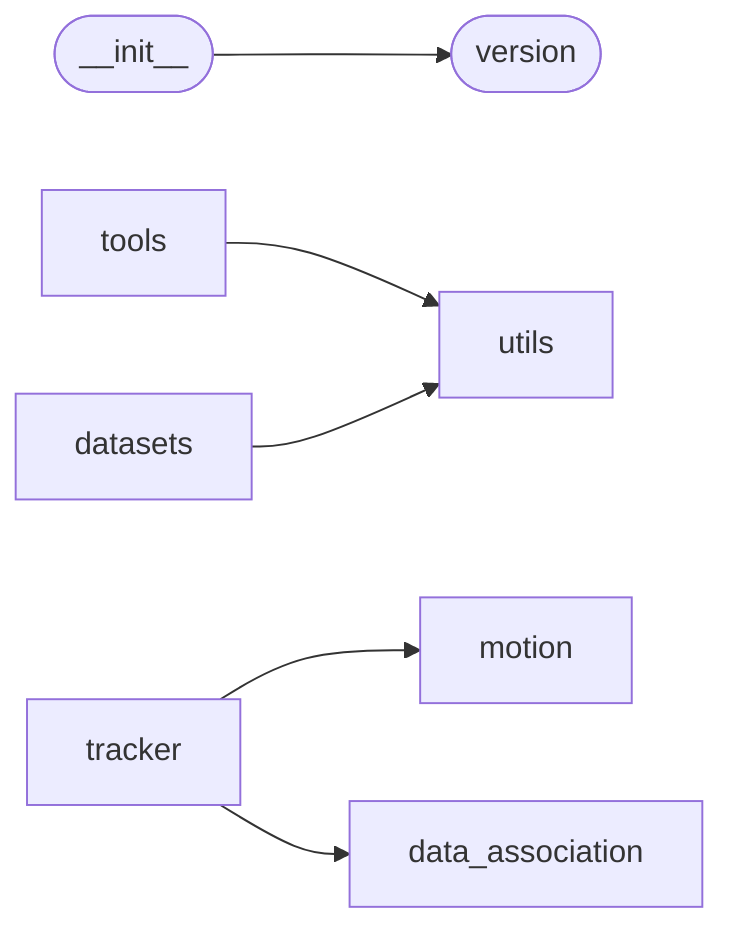

# Code Overview

[_Documentation generated by Documatic_](https://www.documatic.com)

<!---Documatic-section-Codebase Structure Python-start--->
## Codebase Structure Python

The codebase has a 2-deep folder structure,
                with 36 code files in total.

<!---Documatic-block-system_architecture-start--->

<!---Documatic-block-system_architecture-end--->

# #
<!---Documatic-section-Codebase Structure Python-end--->

<!---Documatic-section-Key Objects-start--->
## Key Objects

There are exposed imports at level-0
from the source directory (libmot)

<!---Documatic-block-libmo-start--->

	
<code>libmo</code> (Click to Expand!)

* `libmot.version.__version__`

<!---Documatic-block-libmo-end--->

# #
<!---Documatic-section-Key Objects-end--->

<!---Documatic-section-Important Functions-start--->
## Important Functions

<!---Documatic-block-important_funcs-start--->
<!---Documatic-block-most_used_funcs-start--->
### Most Utilised Functions

* [libmot.utils.path.check_file_exist](5-libmot_utils.md#libmot.utils.path.check_file_exist) (3 times)
* [libmot.utils.path.mkdir_or_exist](5-libmot_utils.md#libmot.utils.path.mkdir_or_exist) (2 times)
* [libmot.tracker.DAN.dan.build_dan](4-libmot_tracker.md#libmot.tracker.DAN.dan.build_dan) (2 times)
* [libmot.utils.iou.iou](5-libmot_utils.md#libmot.utils.iou.iou) (2 times)
* [libmot.utils.path.check_folder_exist](5-libmot_utils.md#libmot.utils.path.check_folder_exist) (2 times)
* libmot.version.__version__ (1 times)
* [libmot.tools.configs.config.add_args](3-libmot_tools.md#libmot.tools.configs.config.add_args) (1 times)
* [libmot.tools.runner.seed.set_random_seed](3-libmot_tools.md#libmot.tools.runner.seed.set_random_seed) (1 times)
* libmot.tracker.kalman_tracker.chi2inv95 (1 times)
* [libmot.tracker.DAN.transforms.collate_fn](4-libmot_tracker.md#libmot.tracker.DAN.transforms.collate_fn) (1 times)
* [libmot.utils.spatial_blocking.iou_blocking](5-libmot_utils.md#libmot.utils.spatial_blocking.iou_blocking) (1 times)
* [libmot.utils.visualization.generate_videos](5-libmot_utils.md#libmot.utils.visualization.generate_videos) (1 times)
* [libmot.utils.iou.iou_torch](5-libmot_utils.md#libmot.utils.iou.iou_torch) (1 times)
* [libmot.utils.evaluation.evaluation_mot](5-libmot_utils.md#libmot.utils.evaluation.evaluation_mot) (1 times)
* [libmot.utils.nms.nms_torch](5-libmot_utils.md#libmot.utils.nms.nms_torch) (1 times)
* [libmot.utils.path.is_str](5-libmot_utils.md#libmot.utils.path.is_str) (1 times)
* [libmot.utils.path.is_path](5-libmot_utils.md#libmot.utils.path.is_path) (1 times)
* [libmot.utils.path.fopen](5-libmot_utils.md#libmot.utils.path.fopen) (1 times)
* [libmot.utils.path.symlink](5-libmot_utils.md#libmot.utils.path.symlink) (1 times)
* [libmot.utils.path.scandir](5-libmot_utils.md#libmot.utils.path.scandir) (1 times)
<!---Documatic-block-most_used_funcs-end--->

<!---Documatic-block-end_user_funcs-start--->
### End User Exposed Functions

* libmot.version.__version__
<!---Documatic-block-end_user_funcs-end--->
<!---Documatic-block-important_funcs-end--->

# #
<!---Documatic-section-Important Functions-end--->

<!---Documatic-section-File IO-start--->
## File IO

<!---Documatic-block-file_io-start--->
The following files have file read operations

<!---Documatic-block-libmot.tools-start--->

	
<code>libmot.tools</code> (Click to Expand!)

* libmot.tools.configs.config

<!---Documatic-block-libmot.tools-end--->

<!---Documatic-block-libmot.tracker-start--->

	
<code>libmot.tracker</code> (Click to Expand!)

* libmot.tracker.DAN.dataset

<!---Documatic-block-libmot.tracker-end--->

<!---Documatic-block-libmot.utils-start--->

	
<code>libmot.utils</code> (Click to Expand!)

* libmot.utils.dataloader
* libmot.utils.path
* libmot.utils.visualization

<!---Documatic-block-libmot.utils-end--->

The following files have file write operations

<!---Documatic-block-libmot.tools-start--->

	
<code>libmot.tools</code> (Click to Expand!)

* libmot.tools.runner.logger

<!---Documatic-block-libmot.tools-end--->
<!---Documatic-block-file_io-end--->

# #
<!---Documatic-section-File IO-end--->

<!---Documatic-section-Class Hierarchy-start--->
## Class Hierarchy

<!---Documatic-block-Exception-start--->

	
<code>Exception</code> (Click to Expand!)

* libmot.tools.runner.timer.TimerError

<!---Documatic-block-Exception-end--->

<!---Documatic-block-libmot.tools.configs.config.ConfigDict-start--->

	
<code>libmot.tools.configs.config.ConfigDict</code> (Click to Expand!)

* libmot.tools.configs.config.ConfigDict

<!---Documatic-block-libmot.tools.configs.config.ConfigDict-end--->

<!---Documatic-block-object-start--->

	
<code>object</code> (Click to Expand!)

* libmot.motion.epipolar_geometry.Epipolar
* libmot.motion.kalman_filter.KalmanFilter
* libmot.tools.configs.config.Config
* libmot.tools.runner.logger.AverageMeter
* libmot.tools.runner.logger.LogManager
* libmot.tools.runner.logger.TermLogger
* libmot.tools.runner.logger.Writer
* libmot.tools.runner.timer.Timer

<!---Documatic-block-object-end--->

# #
<!---Documatic-section-Class Hierarchy-end--->

[_Documentation generated by Documatic_](https://www.documatic.com)