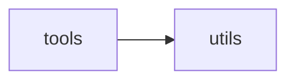

# Libmot Tools

[_Documentation generated by Documatic_](https://www.documatic.com)

<!---Documatic-section-Codebase Structure-start--->
## Codebase Structure

<!---Documatic-block-system_architecture-start--->

<!---Documatic-block-system_architecture-end--->

# #
<!---Documatic-section-Codebase Structure-end--->

<!---Documatic-section-libmot.tools.configs.config.add_args-start--->
## [libmot.tools.configs.config.add_args](3-libmot_tools.md#libmot.tools.configs.config.add_args)

<!---Documatic-section-add_args-start--->
<!---Documatic-block-libmot.tools.configs.config.add_args-start--->
<details>
	<summary><code>libmot.tools.configs.config.add_args</code> code snippet</summary>

```python
def add_args(parser, cfg, prefix=''):
    for (k, v) in cfg.items():
        if isinstance(v, str):
            parser.add_argument('--' + prefix + k)
        elif isinstance(v, int):
            parser.add_argument('--' + prefix + k, type=int)
        elif isinstance(v, float):
            parser.add_argument('--' + prefix + k, type=float)
        elif isinstance(v, bool):
            parser.add_argument('--' + prefix + k, action='store_true')
        elif isinstance(v, dict):
            add_args(parser, v, prefix + k + '.')
        elif isinstance(v, abc.Iterable):
            parser.add_argument('--' + prefix + k, type=type(v[0]), nargs='+')
        else:
            print('cannot parse key {} of type {}'.format(prefix + k, type(v)))
    return parser
```
</details>
<!---Documatic-block-libmot.tools.configs.config.add_args-end--->
<!---Documatic-section-add_args-end--->

# #
<!---Documatic-section-libmot.tools.configs.config.add_args-end--->

<!---Documatic-section-libmot.tools.runner.seed.set_random_seed-start--->
## [libmot.tools.runner.seed.set_random_seed](3-libmot_tools.md#libmot.tools.runner.seed.set_random_seed)

<!---Documatic-section-set_random_seed-start--->
<!---Documatic-block-libmot.tools.runner.seed.set_random_seed-start--->
<details>
	<summary><code>libmot.tools.runner.seed.set_random_seed</code> code snippet</summary>

```python
def set_random_seed(seed=26, deterministic=False, benchmark=False):
    random.seed(seed)
    np.random.seed(seed)
    torch.manual_seed(seed)
    torch.cuda.manual_seed(seed)
    torch.cuda.manual_seed_all(seed)
    if deterministic:
        torch.backends.cudnn.deterministic = True
    if benchmark:
        torch.backends.cudnn.benchmark = True
```
</details>
<!---Documatic-block-libmot.tools.runner.seed.set_random_seed-end--->
<!---Documatic-section-set_random_seed-end--->

# #
<!---Documatic-section-libmot.tools.runner.seed.set_random_seed-end--->

[_Documentation generated by Documatic_](https://www.documatic.com)