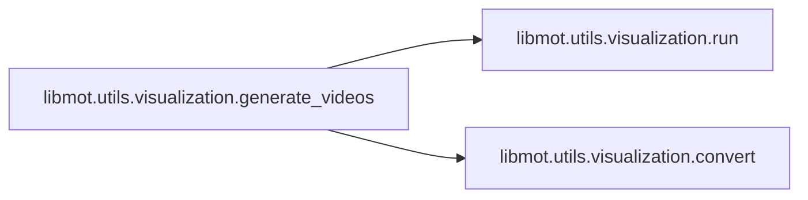
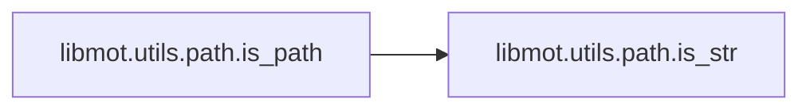
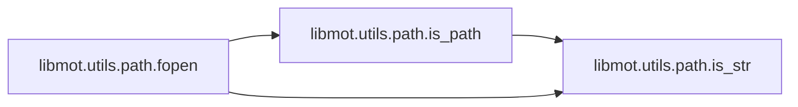
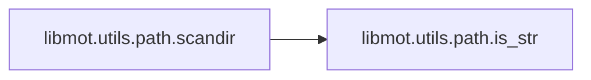

# Libmot Utils

[_Documentation generated by Documatic_](https://www.documatic.com)

<!---Documatic-section-Codebase Structure-start--->
## Codebase Structure

<!---Documatic-block-system_architecture-start--->
```mermaid
None
```
<!---Documatic-block-system_architecture-end--->

# #
<!---Documatic-section-Codebase Structure-end--->

<!---Documatic-section-libmot.utils.path.check_file_exist-start--->
## [libmot.utils.path.check_file_exist](5-libmot_utils.md#libmot.utils.path.check_file_exist)

<!---Documatic-section-check_file_exist-start--->
<!---Documatic-block-libmot.utils.path.check_file_exist-start--->
<details>
	<summary><code>libmot.utils.path.check_file_exist</code> code snippet</summary>

```python
def check_file_exist(filename, msg_tmpl='file "{}" does not exist'):
    if not osp.isfile(filename):
        raise FileNotFoundError(msg_tmpl.format(filename))
```
</details>
<!---Documatic-block-libmot.utils.path.check_file_exist-end--->
<!---Documatic-section-check_file_exist-end--->

# #
<!---Documatic-section-libmot.utils.path.check_file_exist-end--->

<!---Documatic-section-libmot.utils.path.mkdir_or_exist-start--->
## [libmot.utils.path.mkdir_or_exist](5-libmot_utils.md#libmot.utils.path.mkdir_or_exist)

<!---Documatic-section-mkdir_or_exist-start--->
<!---Documatic-block-libmot.utils.path.mkdir_or_exist-start--->
<details>
	<summary><code>libmot.utils.path.mkdir_or_exist</code> code snippet</summary>

```python
def mkdir_or_exist(dir_name, mode=511):
    if dir_name == '':
        return
    dir_name = osp.expanduser(dir_name)
    os.makedirs(dir_name, mode=mode, exist_ok=True)
```
</details>
<!---Documatic-block-libmot.utils.path.mkdir_or_exist-end--->
<!---Documatic-section-mkdir_or_exist-end--->

# #
<!---Documatic-section-libmot.utils.path.mkdir_or_exist-end--->

<!---Documatic-section-libmot.utils.iou.iou-start--->
## [libmot.utils.iou.iou](5-libmot_utils.md#libmot.utils.iou.iou)

<!---Documatic-section-iou-start--->
<!---Documatic-block-libmot.utils.iou.iou-start--->
<details>
	<summary><code>libmot.utils.iou.iou</code> code snippet</summary>

```python
def iou(bboxes, candidates, metric='origin'):
    (bboxes, candidates) = (np.atleast_2d(bboxes), np.atleast_2d(candidates))
    overlap = np.zeros((bboxes.shape[0], candidates.shape[0]))
    if overlap.size == 0:
        return overlap
    if metric == 'shape':
        bboxes[:, :2] *= 0
        candidates[:, :2] *= 0
    elif metric == 'position':
        bboxes[:, :2] -= bboxes[:, 2:] / 2
        candidates[:, :2] -= candidates[:, 2:] / 2
    for (i, bbox) in enumerate(bboxes):
        (bbox_tl, bbox_br) = (bbox[:2], bbox[:2] + bbox[2:])
        candidates_tl = candidates[:, :2]
        candidates_br = candidates[:, :2] + candidates[:, 2:]
        tl = np.c_[np.maximum(bbox_tl[0], candidates_tl[:, 0])[:, np.newaxis], np.maximum(bbox_tl[1], candidates_tl[:, 1])[:, np.newaxis]]
        br = np.c_[np.minimum(bbox_br[0], candidates_br[:, 0])[:, np.newaxis], np.minimum(bbox_br[1], candidates_br[:, 1])[:, np.newaxis]]
        wh = np.maximum(0.0, br - tl)
        area_intersection = wh.prod(axis=1)
        area_bbox = bbox[2:].prod()
        area_candidates = candidates[:, 2:].prod(axis=1)
        overlap[i, :] = area_intersection / (area_bbox + area_candidates - area_intersection)
    return overlap
```
</details>
<!---Documatic-block-libmot.utils.iou.iou-end--->
<!---Documatic-section-iou-end--->

# #
<!---Documatic-section-libmot.utils.iou.iou-end--->

<!---Documatic-section-libmot.utils.path.check_folder_exist-start--->
## [libmot.utils.path.check_folder_exist](5-libmot_utils.md#libmot.utils.path.check_folder_exist)

<!---Documatic-section-check_folder_exist-start--->
<!---Documatic-block-libmot.utils.path.check_folder_exist-start--->
<details>
	<summary><code>libmot.utils.path.check_folder_exist</code> code snippet</summary>

```python
def check_folder_exist(foldername, msg_tmpl='folder "{}" does not exist'):
    if not osp.isdir(foldername):
        raise FileNotFoundError(msg_tmpl.format(foldername))
```
</details>
<!---Documatic-block-libmot.utils.path.check_folder_exist-end--->
<!---Documatic-section-check_folder_exist-end--->

# #
<!---Documatic-section-libmot.utils.path.check_folder_exist-end--->

<!---Documatic-section-libmot.utils.spatial_blocking.iou_blocking-start--->
## [libmot.utils.spatial_blocking.iou_blocking](5-libmot_utils.md#libmot.utils.spatial_blocking.iou_blocking)

<!---Documatic-section-iou_blocking-start--->


### Object Calls

* [libmot.utils.iou.iou](5-libmot_utils.md#libmot.utils.iou.iou)

<!---Documatic-block-libmot.utils.spatial_blocking.iou_blocking-start--->
<details>
	<summary><code>libmot.utils.spatial_blocking.iou_blocking</code> code snippet</summary>

```python
def iou_blocking(tracks, dets, region_shape):
    tracks = np.atleast_2d(tracks)
    dets = np.atleast_2d(dets)
    if not isinstance(region_shape, tuple):
        region_shape = np.atleast_2d(region_shape)
    else:
        region_shape = np.array([[region_shape[0], region_shape[1]]])
        region_shape = np.tile(region_shape, (tracks.shape[0], 1))
    centers = tracks[:, :2] + tracks[:, 2:] / 2.0
    overlap = iou(np.c_[centers - region_shape / 2.0, region_shape], dets)
    keep = overlap > 0
    return keep
```
</details>
<!---Documatic-block-libmot.utils.spatial_blocking.iou_blocking-end--->
<!---Documatic-section-iou_blocking-end--->

# #
<!---Documatic-section-libmot.utils.spatial_blocking.iou_blocking-end--->

<!---Documatic-section-libmot.utils.visualization.generate_videos-start--->
## [libmot.utils.visualization.generate_videos](5-libmot_utils.md#libmot.utils.visualization.generate_videos)

<!---Documatic-section-generate_videos-start--->


### Object Calls

* [libmot.utils.visualization.run](5-libmot_utils.md#libmot.utils.visualization.run)
* [libmot.utils.visualization.convert](5-libmot_utils.md#libmot.utils.visualization.convert)

<!---Documatic-block-libmot.utils.visualization.generate_videos-start--->
<details>
	<summary><code>libmot.utils.visualization.generate_videos</code> code snippet</summary>

```python
def generate_videos(mot_dir, result_dir, output_dir=None, convert_h264=False, update_ms=None):
    if output_dir is not None:
        os.makedirs(output_dir, exist_ok=True)
    else:
        output_dir = './'
    video_filename = None
    if os.path.isdir(result_dir):
        result_list = os.listdir(result_dir)
    elif os.path.isfile(result_dir):
        result_list = [result_dir]
    else:
        if '/' in mot_dir:
            sequence = mot_dir.split('/')
        else:
            sequence = mot_dir.split('\\')
        for s in reversed(sequence):
            if len(s) > 0:
                sequence = s
                break
        video_filename = os.path.join(output_dir, '%s.avi' % sequence)
        run(mot_dir, result_dir, False, None, update_ms, video_filename)
        return
    for sequence_txt in result_list:
        sequence = os.path.splitext(sequence_txt)[0]
        sequence = sequence.split('/')[-1]
        sequence = sequence.split('\\')[-1]
        print(mot_dir)
        if not os.path.exists(mot_dir):
            continue
        video_filename = os.path.join(output_dir, '%s.avi' % sequence)
        print('Saving %s to %s.' % (sequence_txt, video_filename))
        run(mot_dir, sequence_txt, False, None, update_ms, video_filename)
    if not convert_h264:
        return
    for sequence_txt in result_list:
        sequence = os.path.splitext(sequence_txt)[0]
        sequence = sequence.split('/')[-1]
        sequence = sequence.split('\\')[-1]
        if not os.path.exists(mot_dir):
            continue
        filename_in = os.path.join(output_dir, '%s.avi' % sequence)
        filename_out = os.path.join(output_dir, '%s.mp4' % sequence)
        convert(filename_in, filename_out)
```
</details>
<!---Documatic-block-libmot.utils.visualization.generate_videos-end--->
<!---Documatic-section-generate_videos-end--->

# #
<!---Documatic-section-libmot.utils.visualization.generate_videos-end--->

<!---Documatic-section-libmot.utils.iou.iou_torch-start--->
## [libmot.utils.iou.iou_torch](5-libmot_utils.md#libmot.utils.iou.iou_torch)

<!---Documatic-section-iou_torch-start--->
<!---Documatic-block-libmot.utils.iou.iou_torch-start--->
<details>
	<summary><code>libmot.utils.iou.iou_torch</code> code snippet</summary>

```python
def iou_torch(bboxes, candidates):
    N = bboxes.size(0)
    M = candidates.size(0)
    if N == 0 or M == 0:
        return torch.empty(N, M)
    area1 = bboxes[:, 2] * bboxes[:, 3]
    area2 = candidates[:, 2] * candidates[:, 3]
    bboxes[:, 2:] = bboxes[:, :2] + bboxes[:, 2:]
    candidates[:, 2:] = candidates[:, :2] + candidates[:, 2:]
    tl = torch.max(bboxes[:, :2].unsqueeze(1).expand(N, M, 2), candidates[:, :2].unsqueeze(0).expand(N, M, 2))
    br = torch.min(bboxes[:, 2:].unsqueeze(1).expand(N, M, 2), candidates[:, 2:].unsqueeze(0).expand(N, M, 2))
    wh = torch.clamp(br - tl, min=0)
    intersection = wh[:, :, 0] * wh[:, :, 1]
    area1 = area1.unsqueeze(1).expand(N, M)
    area2 = area2.unsqueeze(0).expand(N, M)
    return intersection / (area1 + area2 - intersection)
```
</details>
<!---Documatic-block-libmot.utils.iou.iou_torch-end--->
<!---Documatic-section-iou_torch-end--->

# #
<!---Documatic-section-libmot.utils.iou.iou_torch-end--->

<!---Documatic-section-libmot.utils.evaluation.evaluation_mot-start--->
## [libmot.utils.evaluation.evaluation_mot](5-libmot_utils.md#libmot.utils.evaluation.evaluation_mot)

<!---Documatic-section-evaluation_mot-start--->
<!---Documatic-block-libmot.utils.evaluation.evaluation_mot-start--->
<details>
	<summary><code>libmot.utils.evaluation.evaluation_mot</code> code snippet</summary>

```python
def evaluation_mot(groundtruths, tracks):
    assert isinstance(tracks, list) or isinstance(tracks, np.ndarray), 'inputs must be array'
    gts = pd.DataFrame(groundtruths[:, :6], columns=['FrameId', 'Id', 'X', 'Y', 'Width', 'Height'])
    gts = gts.set_index(['FrameId', 'Id'])
    gts[['X', 'Y']] -= (1, 1)
    box = pd.DataFrame(np.array(tracks[:, :6]), columns=['FrameId', 'Id', 'X', 'Y', 'Width', 'Height'])
    box = box.set_index(['FrameId', 'Id'])
    box[['X', 'Y']] -= (1, 1)
    acc = mm.utils.compare_to_groundtruth(gts, box, 'iou', distth=0.5)
    mh = mm.metrics.create()
    summary = mh.compute(acc, metrics=mm.metrics.motchallenge_metrics, return_dataframe=False)
    return (abs(summary['mota']), abs(summary['motp']), abs(summary['idf1']), abs(summary['num_switches']))
```
</details>
<!---Documatic-block-libmot.utils.evaluation.evaluation_mot-end--->
<!---Documatic-section-evaluation_mot-end--->

# #
<!---Documatic-section-libmot.utils.evaluation.evaluation_mot-end--->

<!---Documatic-section-libmot.utils.nms.nms_torch-start--->
## [libmot.utils.nms.nms_torch](5-libmot_utils.md#libmot.utils.nms.nms_torch)

<!---Documatic-section-nms_torch-start--->
<!---Documatic-block-libmot.utils.nms.nms_torch-start--->
<details>
	<summary><code>libmot.utils.nms.nms_torch</code> code snippet</summary>

```python
def nms_torch(bboxes, scores, threshold=0.5):
    area = (bboxes[:, 2] - bboxes[:, 0]) * (bboxes[:, 3] - bboxes[:, 1])
    x1 = bboxes[:, 0]
    y1 = bboxes[:, 1]
    x2 = bboxes[:, 2]
    y2 = bboxes[:, 3]
    (_, order) = scores.sort(0, descending=True)
    keep = []
    while order.numel() > 0:
        if order.numel() == 1:
            keep.append(order.item())
            break
        else:
            i = order[0].item()
            keep.append(i)
        xx1 = x1[order[1:]].clamp(min=x1[i])
        yy1 = y1[order[1:]].clamp(min=y1[i])
        xx2 = x2[order[1:]].clamp(max=x2[i])
        yy2 = y2[order[1:]].clamp(max=y2[i])
        inter = (xx2 - xx1).clamp(min=0) * (yy2 - yy1).clamp(min=0)
        iou = inter / (area[i] + area[order[1:]] - inter)
        idx = (iou <= threshold).nonzero().squeeze()
        if idx.numel() == 0:
            break
        order = order[idx + 1]
    return torch.LongTensor(keep)
```
</details>
<!---Documatic-block-libmot.utils.nms.nms_torch-end--->
<!---Documatic-section-nms_torch-end--->

# #
<!---Documatic-section-libmot.utils.nms.nms_torch-end--->

<!---Documatic-section-libmot.utils.path.is_str-start--->
## [libmot.utils.path.is_str](5-libmot_utils.md#libmot.utils.path.is_str)

<!---Documatic-section-is_str-start--->
<!---Documatic-block-libmot.utils.path.is_str-start--->
<details>
	<summary><code>libmot.utils.path.is_str</code> code snippet</summary>

```python
def is_str(x):
    return isinstance(x, str)
```
</details>
<!---Documatic-block-libmot.utils.path.is_str-end--->
<!---Documatic-section-is_str-end--->

# #
<!---Documatic-section-libmot.utils.path.is_str-end--->

<!---Documatic-section-libmot.utils.path.is_path-start--->
## [libmot.utils.path.is_path](5-libmot_utils.md#libmot.utils.path.is_path)

<!---Documatic-section-is_path-start--->


### Object Calls

* [libmot.utils.path.is_str](5-libmot_utils.md#libmot.utils.path.is_str)

<!---Documatic-block-libmot.utils.path.is_path-start--->
<details>
	<summary><code>libmot.utils.path.is_path</code> code snippet</summary>

```python
def is_path(x):
    return is_str(x) or isinstance(x, Path)
```
</details>
<!---Documatic-block-libmot.utils.path.is_path-end--->
<!---Documatic-section-is_path-end--->

# #
<!---Documatic-section-libmot.utils.path.is_path-end--->

<!---Documatic-section-libmot.utils.path.fopen-start--->
## [libmot.utils.path.fopen](5-libmot_utils.md#libmot.utils.path.fopen)

<!---Documatic-section-fopen-start--->


### Object Calls

* [libmot.utils.path.is_path](5-libmot_utils.md#libmot.utils.path.is_path)
* [libmot.utils.path.is_str](5-libmot_utils.md#libmot.utils.path.is_str)

<!---Documatic-block-libmot.utils.path.fopen-start--->
<details>
	<summary><code>libmot.utils.path.fopen</code> code snippet</summary>

```python
def fopen(filepath, *args, **kwargs):
    assert is_path(filepath), 'filepath is illegal'
    if is_str(filepath):
        return open(filepath, *args, **kwargs)
    elif isinstance(filepath, Path):
        return filepath.open(*args, **kwargs)
```
</details>
<!---Documatic-block-libmot.utils.path.fopen-end--->
<!---Documatic-section-fopen-end--->

# #
<!---Documatic-section-libmot.utils.path.fopen-end--->

<!---Documatic-section-libmot.utils.path.symlink-start--->
## [libmot.utils.path.symlink](5-libmot_utils.md#libmot.utils.path.symlink)

<!---Documatic-section-symlink-start--->
<!---Documatic-block-libmot.utils.path.symlink-start--->
<details>
	<summary><code>libmot.utils.path.symlink</code> code snippet</summary>

```python
def symlink(src, dst, overwrite=True, **kwargs):
    if os.path.lexists(dst) and overwrite:
        os.remove(dst)
    os.symlink(src, dst, **kwargs)
```
</details>
<!---Documatic-block-libmot.utils.path.symlink-end--->
<!---Documatic-section-symlink-end--->

# #
<!---Documatic-section-libmot.utils.path.symlink-end--->

<!---Documatic-section-libmot.utils.path.scandir-start--->
## [libmot.utils.path.scandir](5-libmot_utils.md#libmot.utils.path.scandir)

<!---Documatic-section-scandir-start--->


### Object Calls

* [libmot.utils.path.is_str](5-libmot_utils.md#libmot.utils.path.is_str)

<!---Documatic-block-libmot.utils.path.scandir-start--->
<details>
	<summary><code>libmot.utils.path.scandir</code> code snippet</summary>

```python
def scandir(dir_path, suffix=None, blacklists=None, recursive=False):
    if isinstance(dir_path, (str, Path)):
        dir_path = str(dir_path)
    else:
        raise TypeError('"dir_path" must be a string or Path object')
    if suffix is not None and (not isinstance(suffix, (str, tuple))):
        raise TypeError('"suffix" must be a string or tuple of strings')
    if blacklists is not None and (not isinstance(blacklists, (str, tuple))):
        raise TypeError('"blacklists" must be a string or tuple of strings')
    root = dir_path

    def in_blacklists(filepath, blacklists):
        if blacklists is None:
            return False
        if is_str(blacklists):
            blacklists = (blacklists,)
        for s in blacklists:
            if s in filepath:
                return True
        return False

    def _scandir(dir_path, suffix, recursive):
        if not osp.isdir(dir_path):
            return
        for entry in os.scandir(dir_path):
            if not entry.name.startswith('.') and entry.is_file():
                rel_path = osp.relpath(entry.path, root)
                if in_blacklists(rel_path, blacklists):
                    continue
                if suffix is None:
                    yield rel_path
                elif rel_path.endswith(suffix):
                    yield rel_path
            elif recursive:
                yield from _scandir(entry.path, suffix=suffix, recursive=recursive)
            else:
                continue
    return _scandir(dir_path, suffix=suffix, recursive=recursive)
```
</details>
<!---Documatic-block-libmot.utils.path.scandir-end--->
<!---Documatic-section-scandir-end--->

# #
<!---Documatic-section-libmot.utils.path.scandir-end--->

<!---Documatic-section-libmot.utils.visualization.run-start--->
## [libmot.utils.visualization.run](5-libmot_utils.md#libmot.utils.visualization.run)

<!---Documatic-section-run-start--->
<!---Documatic-block-libmot.utils.visualization.run-start--->
<details>
	<summary><code>libmot.utils.visualization.run</code> code snippet</summary>

```python
def run(sequence_dir, result_file, show_false_alarms=False, detection_file=None, update_ms=None, video_filename=None):
    seq_info = gather_sequence_info(sequence_dir, detection_file)
    if os.path.isfile(result_file):
        results = np.loadtxt(result_file, delimiter=',')
    else:
        results = result_file
        seq_info['max_frame_idx'] = max(results[:, 0])

    def frame_callback(vis, frame_idx):
        print('Frame idx', frame_idx)
        image = cv2.imread(seq_info['image_filenames'][frame_idx], cv2.IMREAD_COLOR)
        vis.set_image(image.copy())
        mask = results[:, 0].astype(np.int) == frame_idx
        track_ids = results[mask, 1].astype(np.int)
        boxes = results[mask, 2:6]
        vis.draw_groundtruth(track_ids, boxes)
        vis.draw_tail(track_ids, frame_idx, results)
    if update_ms is None:
        update_ms = seq_info['update_ms']
    if update_ms is None:
        update_ms = DEFAULT_UPDATE_MS
    visualizer = Visualization(seq_info, update_ms)
    if video_filename is not None:
        visualizer.viewer.enable_videowriter(video_filename)
    visualizer.run(frame_callback)
```
</details>
<!---Documatic-block-libmot.utils.visualization.run-end--->
<!---Documatic-section-run-end--->

# #
<!---Documatic-section-libmot.utils.visualization.run-end--->

<!---Documatic-section-libmot.utils.visualization.convert-start--->
## [libmot.utils.visualization.convert](5-libmot_utils.md#libmot.utils.visualization.convert)

<!---Documatic-section-convert-start--->
<!---Documatic-block-libmot.utils.visualization.convert-start--->
<details>
	<summary><code>libmot.utils.visualization.convert</code> code snippet</summary>

```python
def convert(filename_in, filename_out, ffmpeg_executable='ffmpeg'):
    import subprocess
    command = [ffmpeg_executable, '-i', filename_in, '-c:v', 'libx264', '-preset', 'slow', '-crf', '21', filename_out]
    subprocess.call(command)
```
</details>
<!---Documatic-block-libmot.utils.visualization.convert-end--->
<!---Documatic-section-convert-end--->

# #
<!---Documatic-section-libmot.utils.visualization.convert-end--->

[_Documentation generated by Documatic_](https://www.documatic.com)